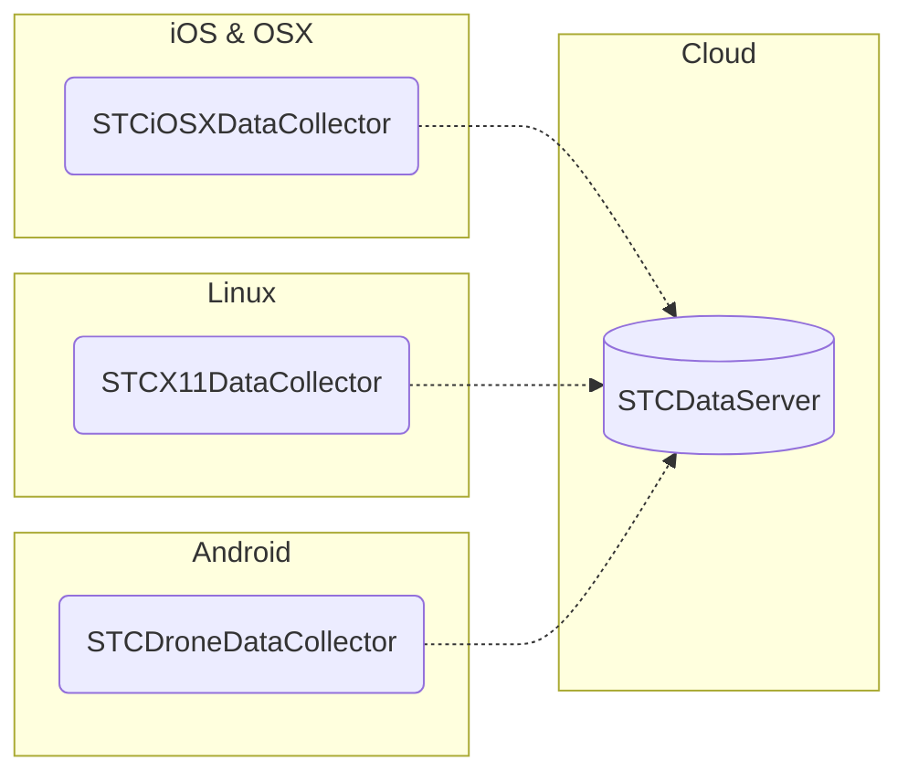

```mermaid
flowchart LR
  subgraph iOS & OSX
    c1(STCiOSXDataCollector)
    click c1 href "https://github.com/STCData/STCiOSXDataCollector"
  end
  
  subgraph Linux
    c2(STCX11DataCollector)
    click c2 href "https://github.com/STCData/STCX11DataCollector"
  end
  subgraph Android 
    c3(STCDroneDataCollector)
    click c3 href "https://github.com/STCData/STCDroneDataCollector"
  end
  subgraph Cloud
    s[(STCDataServer)]
    click s href "https://github.com/STCData/STCDataServer"
  end
    c1 & c2 & c3 -.-> s
```
