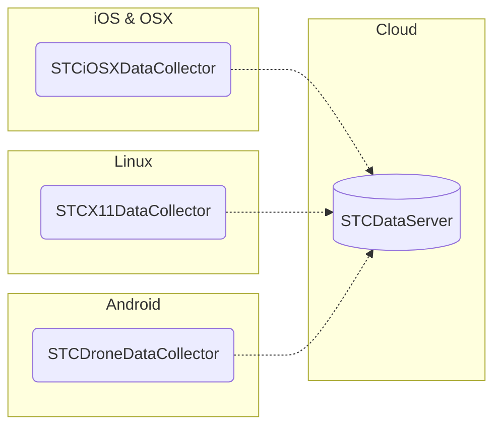

```mermaid
flowchart LR
  subgraph iOS & OSX
    c1(STCiOSXDataCollector)
    click c1 https://github.com/STCData/STCiOSXDataCollector "iOS/OSX application that logs detected text, human poses, window manager information and user actions from built in web browser, terminal emulator, camera, and any other external application"
  end
  
  subgraph Linux
    c2(STCX11DataCollector)
  end
  subgraph Android 
    c3(STCDroneDataCollector)
  end
  subgraph Cloud
    s[(STCDataServer)]
  end
    c1 & c2 & c3 -.-> s
```
