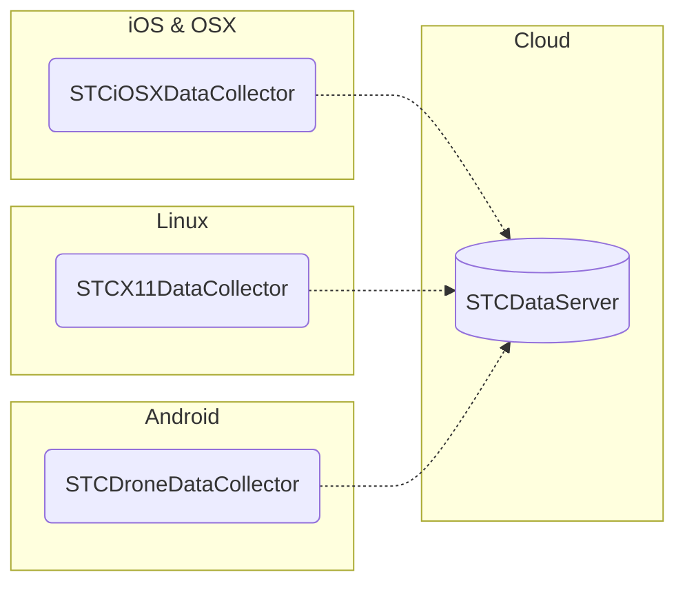

[STCData](https://stcdata.github.io/STCData/) is a system for collecting data from user devices for machine learning. Features include:

 - Support for video, image, speech, text and structured data mining
 - Data collection applications for [iOS, MacOS](https://stcdata.github.io/STCData/docs/Collectors/ios.html), [Android](https://stcdata.github.io/STCData/docs/Collectors/drone.html), [Linux](https://stcdata.github.io/STCData/docs/Collectors/x11.html)
 - On device real time data pre-labeling using fast [vendor provided] models
 - Realtime data streaming
 - [Data offloading to eventually available servers and pre upload on device data storage balancing](https://stcdata.github.io/STCData/docs/EventualAvailability.html)

STCData could be used both as a starting point for building out your own data collection pipeline or as ready solution. It's iOS/MacOS application could be installed as data collecting appliance. It features:

 - ML aware browser with hierarchical tabs
 - In-app and system user actions mining
 - Camera with hands and body poses recognition
