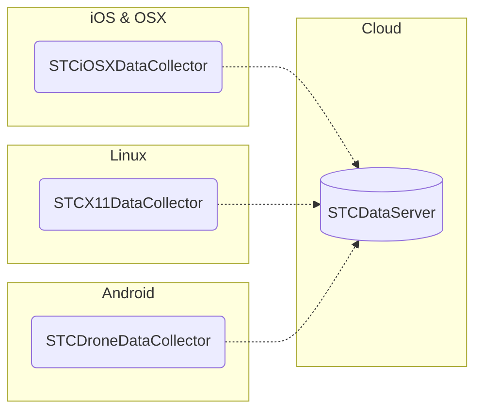

[STCData] is a system for collecting data from user devices for machine learning. Features include:

 - Support for video, speech, text and structured data, structured UI screenshots, user actions, human hands and body poses, aerial video human and vehicles mining
 - Data collection applications for [iOS, MacOS], [Android], [Linux]
 - On device real time data pre-labeling using fast [vendor provided] models
 - Realtime data streaming
 - [Data offloading to eventually available servers and pre upload on device data storage balancing]
